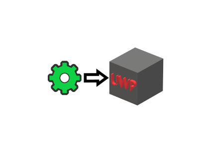
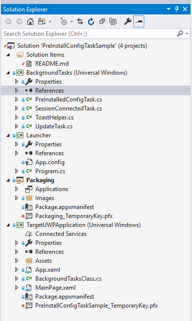
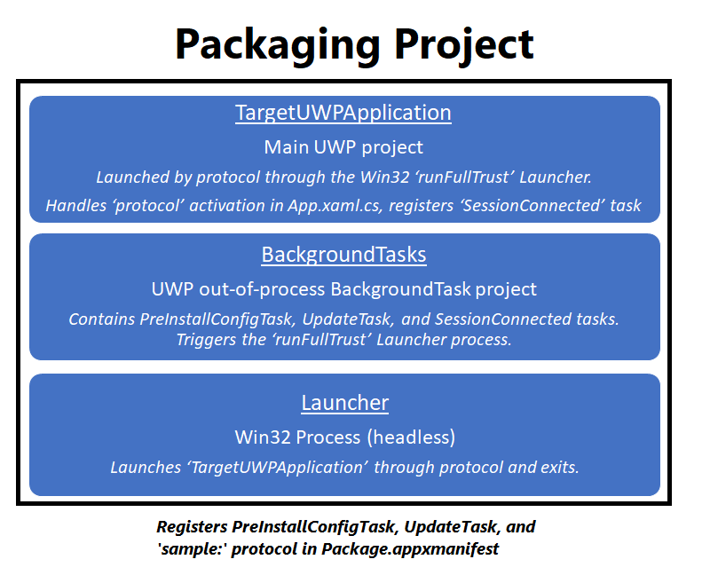
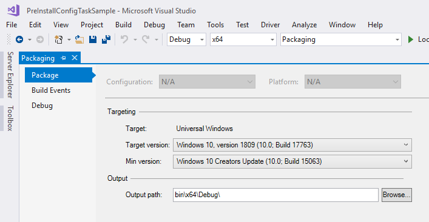
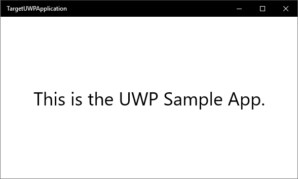

# PreInstallConfigTask Sample
## Windows - Developer Incubation and Learning - Paula Scholz

<figure>
  
</figure>
Original Equipment Manufacturers (OEMs) and enterprises that create their own operating system images for deployment sometimes need to ship pre-installed applications.  Preinstall and update tasks provide the mechanisms that allow these tasks to run in the background before the app is installed or when it is updated.

Here are the general rules that govern these tasks.
  *  Your app manifest can contain only one `PreInstallConfigTask` and one `UpdateTask`.
  *  Deployment tasks are applicable to any platform type.
  *  Deployment tasks can execute after the deployment operation has been completed and committed.
  *  Failed deployment tasks are not restarted.
  *  Failed deployment tasks do not affect the successful deployment of the app.
  *  Deployment tasks are not restarted after reboot.
  *  Deployment tasks should not depend on one another.

In a UWP application, normal [BackgroundTasks](https://docs.microsoft.com/en-us/windows/uwp/launch-resume/support-your-app-with-background-tasks "Support your app with background tasks") must be registered with the operating system in code by API, but the `PreInstallConfigTask` and `UpdateTask` are deployment tasks that are registered by their manifest before the application ever runs.

In this sample, we will demonstrate the use of the deployment `PreInstallConfigTask` task to automatically run a target UWP application on first startup.  The act of running the target application can register any regular BackgroundTasks and we will show how to do this.

We will show how to use the `UpdateTask` to display a Toast notification when the application's build number is incremented during a software update.  You may augment this task with your own operations if needed.

We will show how to register a "`Protocol`" in the application manifest so the application can be started by referencing a URI, either from a browser or another application.  We will use this capability to support our auto-run operations.

Finally, we will use the `SessionConnected` task, a normal UWP BackgroundTask fired by a `SystemEvent` trigger, to auto-run the target UWP application after user login by using the `Protocol`.  This task will also show a Toast notification.

# Visual Studio Solution

The Visual Studio solution is shown below.  There are four projects:
<figure>
  
</figure>

From the top down, we first see the `BackgroundTasks` project, a Universal Windows project. As the name suggests, this is the out-of-process [BackgroundTasks](https://docs.microsoft.com/en-us/windows/uwp/launch-resume/create-and-register-a-background-task "Create and register an out-of-process background task") project of our solution and runs as a separate process when the main UWP application is not in the foreground.

Next, we see the `Launcher` project.  This is a simple "runFullTrust" Win32 application that has the sole purpose of launching the main UWP application by URI [protocol](https://msdn.microsoft.com/en-us/magazine/mt842502.aspx "Protocol Registration and Activation in UWP Apps").  This pure Win32 application is launched by the PreInstallConfigTask and SessionConnected background tasks in response to triggering events.

Next, the solution contains `Packaging`, the start-up project, which is the [Windows Application Packaging Project](https://docs.microsoft.com/en-us/windows/uwp/porting/desktop-to-uwp-packaging-dot-net "Package a desktop application by using Visual Studio") for our solution.  It is within the context of this project that our solution will be packaged for sideloading and deployment to the [Windows Store](https://www.microsoft.com/en-us/store/apps/windows "Windows Store main page").  This is the project where package capabilities, store logos, and configuration are set.

Finally, the `TargetUWPApplication` project, which is our very simple UWP application that is supported by the BackgroundTasks and Launcher projects.  This is a very simple single-page UWP application that does nothing. We have modified it to respond to protocol activation by the `sample:` URI protocol defined in the `Package.appxmanifest` file of the `Packaging` project.  This application also registers the `SessionConnected` background task and trigger, which runs when a user's session is connected.  

Let's look at how these projects relate to each other:
<figure>
  
</figure>

# Packaging Project

The `Packaging` project is the solution's startup project, and is the [Windows Application Packaging Project](https://docs.microsoft.com/en-us/windows/uwp/porting/desktop-to-uwp-packaging-dot-net) container for our application bundle.  This project contains the packaging manifest where we declare capabilities needed by included application projects.    It is also built for **Windows 10, Version 1809 (build 17763)**, and you need to run this on that version of Windows or better to use Win32 `fullTrust` capabilities.
<figure>
  
</figure>

Those capabilities are declared in the project's `Package.appxmanifest` file.  You will have to view this file as code to edit the required properties.  There are three XML blocks in this file that concern us.

The first of these is the enclosing `Package` node at the top of the file.  Here, two additional namespaces are declared to support Desktop Bridge.  These are `rescap`, and `desktop`.  `Rescap` lets us declare restricted app capabilities, and `desktop` contains references to the [Windows Desktop Extensions](https://docs.microsoft.com/en-us/windows/uwp/porting/desktop-to-uwp-extensions) needed for Desktop Bridge.

```xml
<Package xmlns="http://schemas.microsoft.com/appx/manifest/foundation/windows10" 
         xmlns:mp="http://schemas.microsoft.com/appx/2014/phone/manifest" 
         xmlns:uap="http://schemas.microsoft.com/appx/manifest/uap/windows10" 
         xmlns:desktop="http://schemas.microsoft.com/appx/manifest/desktop/windows10" 
        xmlns:rescap="http://schemas.microsoft.com/appx/manifest/foundation/windows10/restrictedcapabilities"
         IgnorableNamespaces="uap mp rescap">
```
The `Extensions` child node of the `Applications` node is where we declare our out-of-process `BackgroundTasks` and `windows.fullTrustProcess` for access to restricted Win32 APIs, and a relative path within the application bundle to that Win32 executable.  This is also where we register two of our three background tasks, the `PreInstallConfigTask` and `UpdateTask` deployment tasks.  Because the `SessionConnected` task is not a deployment task, it must be registered by the `TargetUWPApplication` in code.

We also declare the `Protocol` used to launch the `TargetUWPApplication` from a URI. Here, the protocol `sample` is registered and when `sample:` is typed into a browser like Microsoft Edge, or activated using `Process.Start()`, the `TargetUWPApplication` will launch. Note that the browser requires the trailing colon, but is not part of the `Protocol` declaration.

```xml
 <Extensions>
        <Extension Category="windows.backgroundTasks" EntryPoint="BackgroundTasks.SessionConnectedTask">
          <BackgroundTasks>
            <Task Type="systemEvent" />
          </BackgroundTasks>
        </Extension>
        <Extension Category="windows.updateTask" EntryPoint="BackgroundTasks.UpdateTask" />
        <Extension Category="windows.preInstalledConfigTask" EntryPoint="BackgroundTasks.PreInstalledConfigTask" />
        <uap:Extension Category="windows.protocol" >
          <uap:Protocol Name="sample" />
        </uap:Extension>
        <desktop:Extension Category="windows.fullTrustProcess" Executable="Launcher\Launcher.exe" />
      </Extensions>
```
The last node we need to modify is the `Capabilities` node.  Here, we add the restricted capability `runFullTrust`, like this:
```xml
  <Capabilities>
    <Capability Name="internetClient" />
    <rescap:Capability Name="runFullTrust" />
  </Capabilities>
```

# TargetUWPApplication - Universal Windows Platform Project
The `TargetUWPApplication` project is a simple single-page UWP application that handles `Protocol` [activation](https://docs.microsoft.com/en-us/windows/uwp/launch-resume/handle-uri-activation "Handle URI activation") and registers the `SessionConnected` background task. It looks like this:
<figure>
  
</figure>

In `TargetUWPApplication` the `OnActivated` event handler in `App.xaml.cs` receives all activation events and works almost exactly like `OnLaunched`. In our example, it looks like this:

```c#
        /// <summary>
        /// Handle protocol navigation.
        /// https://docs.microsoft.com/en-us/windows/uwp/launch-resume/handle-uri-activation
        /// 
        /// If protocol launched for results, modify to follow this procedure:
        /// https://docs.microsoft.com/en-us/windows/uwp/launch-resume/how-to-launch-an-app-for-results
        /// </summary>
        /// <param name="args"></param>
        protected override void OnActivated(IActivatedEventArgs args)
        {
            if (args.Kind == ActivationKind.Protocol)
            {
                ProtocolActivatedEventArgs eventArgs = args as ProtocolActivatedEventArgs;

                Frame rootFrame = Window.Current.Content as Frame;

                // Do not repeat app initialization when the Window already has content,
                // just ensure that the window is active
                if (rootFrame == null)
                {
                    // Create a Frame to act as the navigation context and navigate to the first page
                    rootFrame = new Frame();

                    rootFrame.NavigationFailed += OnNavigationFailed;

                    if (eventArgs.PreviousExecutionState == ApplicationExecutionState.Terminated)
                    {
                        //TODO: Load state from previously suspended application
                    }

                    // Place the frame in the current Window
                    Window.Current.Content = rootFrame;
                }

                if (rootFrame.Content == null)
                {
                    // When the navigation stack isn't restored navigate to the first page,
                    // configuring the new page by passing required information as a navigation
                    // parameter
                    rootFrame.Navigate(typeof(MainPage));
                }

                // Ensure the current window is active
                Window.Current.Activate();
            }
        }
```
Next, we have to register the `SessionConnected` background task so it will be called each time the user logs on.  This registration is triggered in the MainPage.OnNavigatedTo event handler in `MainPage.xaml.cs`, like this:

```c#
        /// <summary>
        /// Invoked when this page is about to be displayed in a Frame.
        /// </summary>
        /// <param name="e">Event data that describes how this page was reached.  The Parameter
        /// property is typically used to configure the page.</param>
        protected async override void OnNavigatedTo(NavigationEventArgs e)
        {
            // Only the SessionConnectedTask requires registration.  PreInstallConfigTask and UpdateTask do not.
            var sessionTaskRegistration = await BackgroundTasksClass.RegisterSessionConnectedBackgroundTask();

            foreach (var task in BackgroundTaskRegistration.AllTasks)
            {
                if (task.Value.Name == App.SessionConnectedBackgroundTaskName)
                {
                    // attach the Progress and Completed handlers
                    AttachProgressAndCompletedHandlers(task.Value);
                    break;
                }
            }

            // doesn't do anything in this demo, but is the pattern if you need it
            UpdateUI();
        }

        /// <summary>
        /// Attach progress and completed handers to a background task.
        /// </summary>
        /// <param name="task">The task to attach progress and completed handlers to.</param>
        private void AttachProgressAndCompletedHandlers(IBackgroundTaskRegistration task)
        {
            task.Progress += new BackgroundTaskProgressEventHandler(OnProgress);
            task.Completed += new BackgroundTaskCompletedEventHandler(OnCompleted);
        }
```
Note that we are using some static variables declared in `App.xaml.cs`.  These are:

```c#
        public const string SessionConnectedBackgroundTaskEntryPoint = "BackgroundTasks.SessionConnectedTask";
        public const string SessionConnectedBackgroundTaskName = "SessionConnectedTask";
        public static string SessionConnectedBackgroundTaskProgress = "";
        public static bool SessionConnectedBackgroundTaskRegistered = false;
```
The code that does the actual task registration is located in `BackgroundTasksClass.cs`.  This class must be sealed for registration to succeed.  There are three methods in this class, one for registering a background task, one for unregistering it, and one that specifically registers the `SessionConnected` task.  That function looks like this:

```c#
        /// <summary>
        /// Register a SessionConnectedTask.
        /// </summary>
        /// <param name="sender"></param>
        /// <param name="e"></param>
        public static async Task<BackgroundTaskRegistration> RegisterSessionConnectedBackgroundTask()
        {
            // see if we're able to register a background task
            BackgroundAccessStatus permissionGranted = await BackgroundExecutionManager.RequestAccessAsync();

            BackgroundTaskRegistration backgroundTaskRegistration = null;

            // If denied access, the task will not run.
            if (permissionGranted != BackgroundAccessStatus.DeniedBySystemPolicy &&
                 permissionGranted != BackgroundAccessStatus.DeniedByUser &&
                 permissionGranted != BackgroundAccessStatus.Unspecified)
            {
                // it has to be unregistered first, even if never registered before
                UnregisterBackgroundTasks(App.SessionConnectedBackgroundTaskName);

                // the trigger for the task, in this case, the SessionConnected event
                SystemTrigger trigger = new SystemTrigger(SystemTriggerType.SessionConnected, false);

                // now register it with the static parameters declared in App.xaml.cs
                backgroundTaskRegistration = RegisterBackgroundTask(App.SessionConnectedBackgroundTaskEntryPoint,
                                                                       App.SessionConnectedBackgroundTaskName,
                                                                       trigger,
                                                                       null);
            }

            return backgroundTaskRegistration;
        }
```

Of special note is the `SystemTrigger` [class](https://docs.microsoft.com/en-us/uwp/api/Windows.ApplicationModel.Background.SystemTrigger "SystemTrigger class") used for the background task. We are using the `SessionConnected` [trigger](https://docs.microsoft.com/en-us/uwp/api/windows.applicationmodel.background.systemtriggertype "SystemTriggerType enum"), which fires when a user logs on to Windows.  There are other triggers for other event types.

# BackgroundTasks Project

